# 🗺️ PathPilotRouteX – Real-Time Pathfinding Android App

PathPilotRouteX is a modern, map-based Pathfinding Android application built using **Kotlin** and **Jetpack Compose**, designed to provide real-time route tracking, dynamic marker updates, and efficient location handling with a scalable MVVM architecture.

---

## 🚀 Key Features

- 🗺️ Interactive Map UI using Google Maps SDK  
- 📍 Real-time Location Tracking (updates every 5 seconds) (Blue Marker) 
- 🔄 Live Marker Updates using Firebase Firestore (Red Markers)  
- 🧭 Route Rendering using Google Directions API  
- 📌 Multi-point Routing with dynamic waypoints (Pink Marker) 
- ⚡ Smooth UI with Jetpack Compose  
- 🔁 Reactive data handling using Flow & CallbackFlow  
- 🔋 Battery-efficient location tracking with Fused Location Provider  

---

## 🏗️ Architecture

The app follows **MVVM (Model-View-ViewModel)** architecture for clean separation of concerns and scalability.

- **View** → Jetpack Compose UI  
- **ViewModel** → Handles UI state using StateFlow  
- **Model** → Firebase + Retrofit + Location Services  

---

## 🛠️ Tech Stack

- **Language:** Kotlin  
- **UI:** Jetpack Compose + Google Maps SDK  
- **Architecture:** MVVM  
- **Dependency Injection:** Hilt  
- **Backend:** Firebase Firestore  
- **Networking:** Retrofit (Directions API)  
- **Location Services:** Fused Location Provider  
- **Async Handling:** Kotlin Coroutines + Flow  
- **State Management:** StateFlow, SnapshotStateList  

---

## 📦 Key Implementations

### 🗺️ Real-Time Navigation
- Integrated Google Maps SDK for map rendering  
- Real-time user location updates every 5 seconds  

### ☁️ Firebase Integration
- Firestore used for live marker updates  
- Implemented using **Flow & CallbackFlow**  

### 🧭 Route Rendering
- Directions API integrated using Retrofit  
- Supports multiple waypoints and dynamic routing  

### 📍 Location Tracking
- Fused Location Provider for accurate and battery-efficient tracking  

### 🔄 State Management
- Managed using StateFlow and SnapshotStateList  

### ⚡ Performance Optimization
- Coroutines for non-blocking UI  
- Efficient API calls and state updates  

---

## 📈 Future Enhancements

- 🚦 Traffic-aware routing  
- 📡 Offline map support  
- 🔔 Real-time alerts & notifications  
- 🧑‍🤝‍🧑 Live user tracking & sharing  

---

## 🤝 Contributing

Contributions are always welcome!

Feel free to fork the project and submit pull requests.

---

## 👨‍💻 Author

- [@letsgoaditya](https://github.com/letsgoaditya)

---

## 📬 Feedback

If you have any feedback, feel free to reach out:  
📧 adityarana65@gmail.com  

---

  Made with ❤️ by Aditya Rana

---

## 📸 Screenshots

### 🏠 Home & UI

  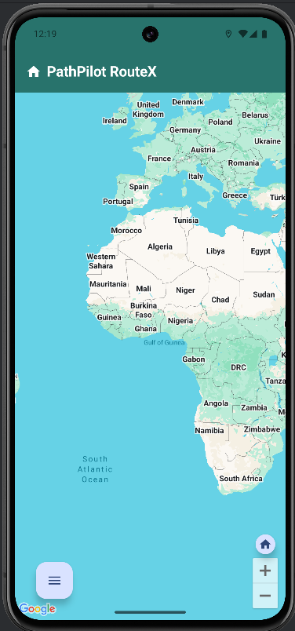
  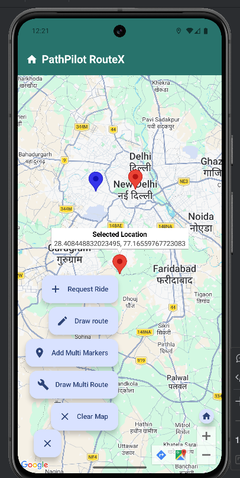
  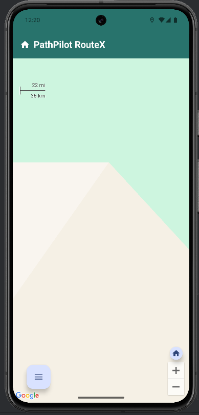

### 📍 Live Location & Markers

  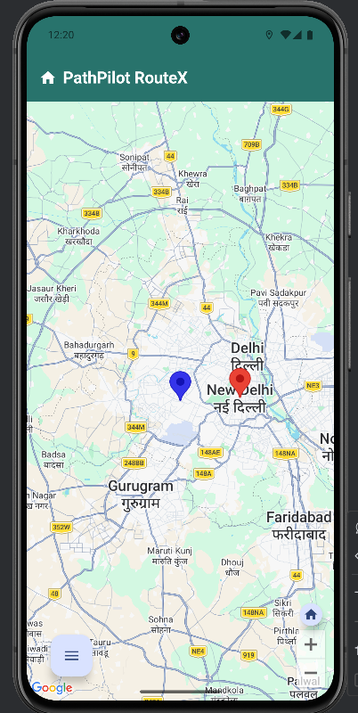
  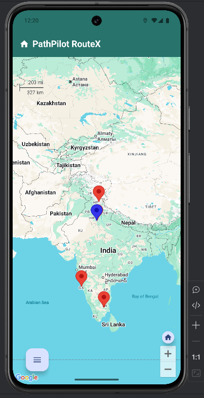
  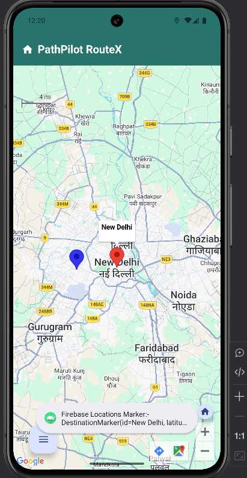

### ➕ Add & Manage Markers

  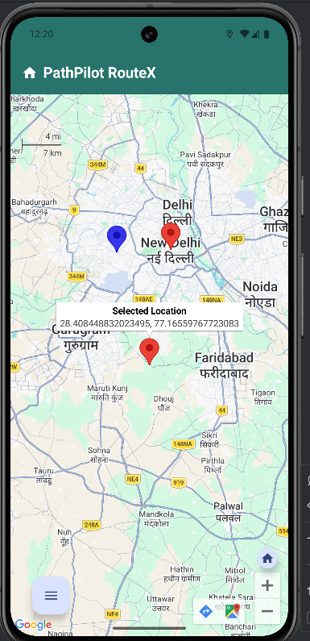

### 🧭 Route Navigation

  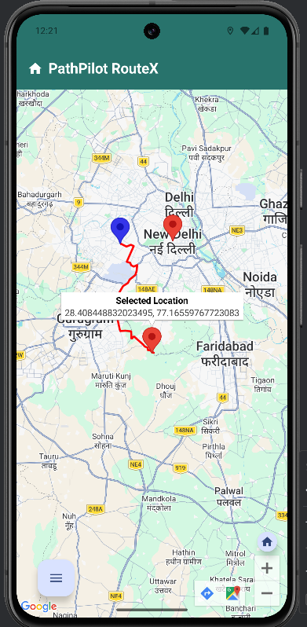
  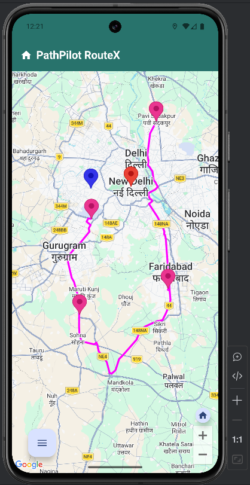

### 🛣️ Multi-Route System

  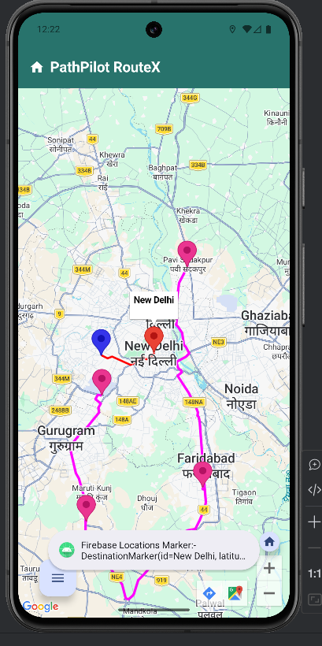

### 🧹 Map Controls

  

### 🔥 Firebase / Backend

  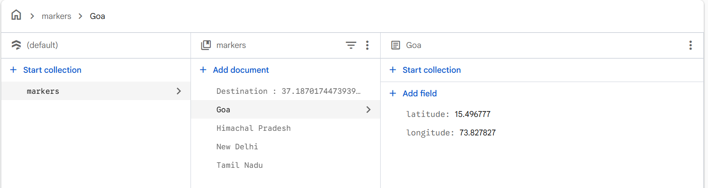
 

 

---

# ⚠️ Setup Notes

> Please complete the following steps before running the project:

---

### 🔑 Firebase Configuration

- Set up your project in the **Firebase Console**
- Download the `google-services.json` file
- Place it inside the project directory:app/google-services.json

- Ensure the file name is exactly **`google-services.json`** (do not rename)

---

### ☁️ Firestore Database Setup

- Configure **Firebase Firestore** according to the project structure
- Refer to the screenshots provided in this repository for guidance

---

### 📍 Location Permissions

- Ensure location permissions are enabled:
- ACCESS_FINE_LOCATION  
- ACCESS_COARSE_LOCATION  

---

### 🔑 API Configuration

- Add your **Google Maps API Key** in: `local.properties` file in the root directory with name "MAPS_API_KEY"
#### Enable:
- Google Maps SDK for Android  
- Google Directions API  

---

## 💡 Important Note

- The `google-services.json` and `local.properties` file is **not included** in this repository for security reasons so it is added to my `.gitignore` file to prevent accidental exposure

---

